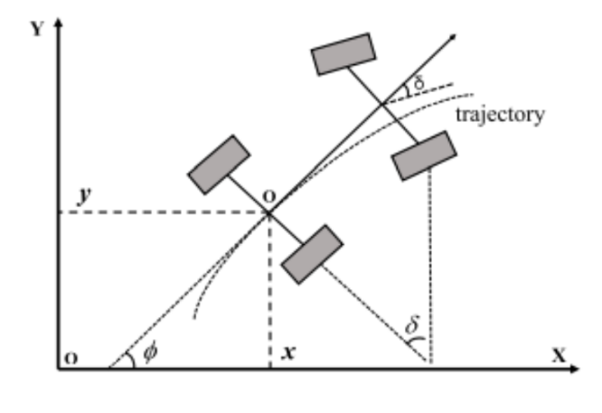
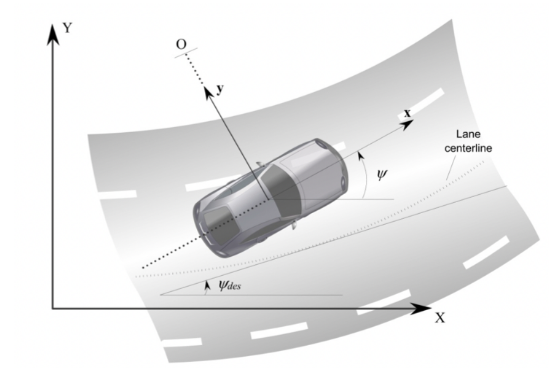
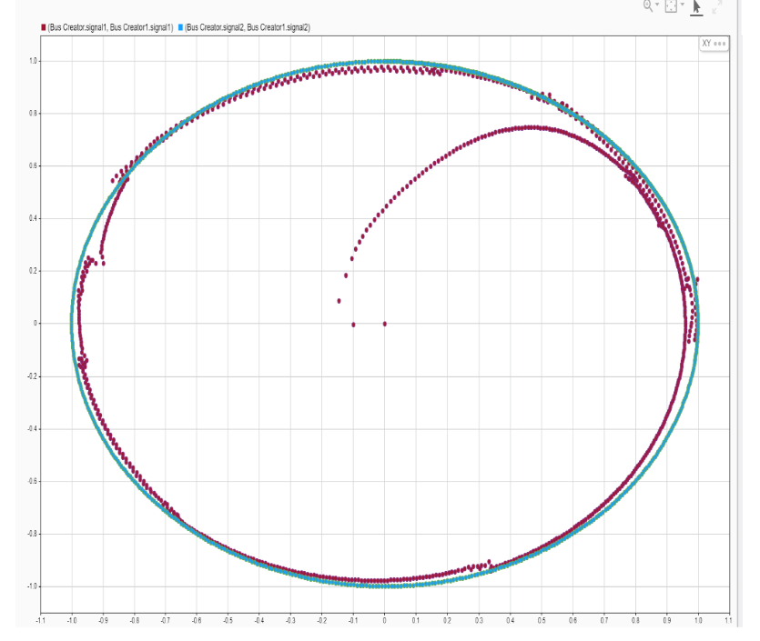
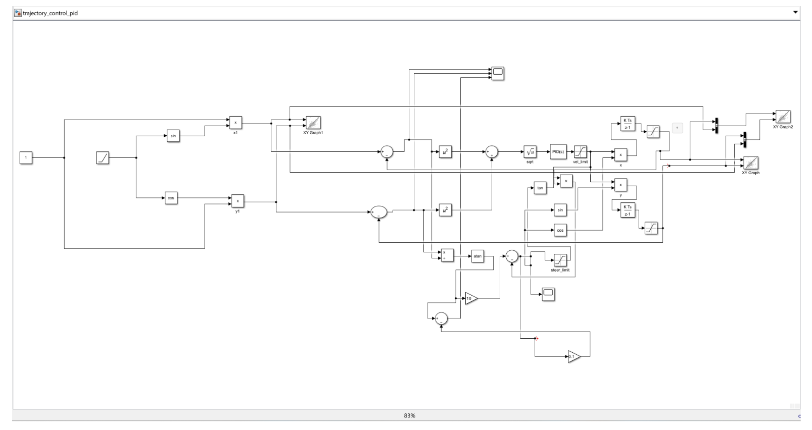
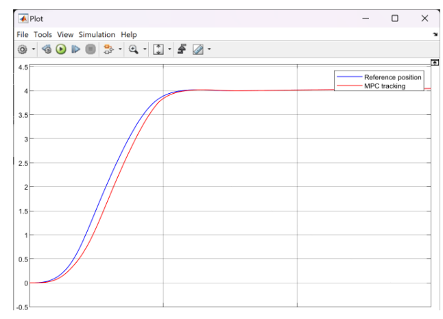
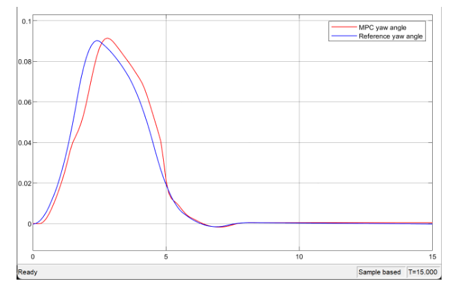

# Trajectory Tracking of Autonomous Vehicle Using PID and MPC Controllers

This repository contains a study of trajectory tracking for an autonomous vehicle using two different controllers: Proportional-Integral-Derivative (PID) and Model Predictive Control (MPC). The study compares the performance of both controllers in tracking a reference trajectory.

## Overview

In this project, we simulate an autonomous vehicle's path following capabilities using two controllers:
1. **PID Controller** - A simple and classic control approach, tuned to guide the vehicle along a reference path.
2. **MPC Controller** - A more advanced controller that predicts future system behavior, takes into account dynamic constraints, and adjusts the control input accordingly.

 ### Vehicle Kinematic Model

  

### Lateral Vehicle Dynamics

  

## Key Components:
- **Vehicle Model:** A kinematic model of an autonomous vehicle is used to simulate the motion based on control inputs.
- **Reference Path:** The reference trajectory used for testing the controllers is a unit circle for the PID controller and a step input trajectory for the MPC controller.
- **Controller Implementation:** MATLAB/Simulink is used for designing the controllers, simulating the system, and visualizing the results.

## Files Included
- **Car and Reference Images:** Images representing the vehicle and reference trajectory.
- **Driving Scenario:** A driving scenario created using MATLAB's Driving Scenario Design app to generate waypoints, which are then used to calculate reference trajectory position values and yaw angles.
- **MPC Simulink Model Files:**
  - **AutonomousSteeringSystem.slx**: The main Simulink model used for simulating the MPC-based autonomous vehicle steering system.
  - **Meldas_library.slx**: A reference library used to understand and implement Model Predictive Control (MPC), adapted from MathWorks' MPC videos [here](https://www.mathworks.com/videos/series/understanding-model-predictive-control.html).
  - **Params.mat**: The parameter values required for the vehicle and MPC controller, including vehicle model parameters and MPC tuning.

## Instructions for the Simulation

1. **Open the Library:**
   - Open the `Meldas_library.slx` Simulink library to check and modify the MPC configuration.
   
2. **Load Parameters:**
   - Open the `Params.mat` file to load the necessary parameter values into the workspace for the Simulink model.
   
3. **Run the Main Simulation Model:**
   - Open and run the Simulink model `AutonomousSteeringSystem.slx` to start the simulation.

## Simulation Results

### PID Controller Results:
- The vehicle follows a unit circular reference trajectory with minimal deviation.
- The error in x, y, and orientation values is plotted over time.
- The PID controller uses the following gains:
  - Kp: 5.5
  - Ki: 3
  - Kd: 0.5

### Trajectory Tracking using PID Controller

  

### Block Diagram for the Path Tracking using PID Control

  

### MPC Controller Results:
- The MPC controller tracks the reference path (step input trajectory) more accurately.
- Lateral positions and yaw angles are compared between the reference and actual trajectory.

### Lateral Positions of Reference and MPC Tracking

  

### Yaw Angles of Reference and MPC

  

### Comparative Analysis:
- The PID controller shows minor deviations in the tracking error, particularly at the left and right ends of the trajectory.
- The MPC controller provides better accuracy in tracking the reference trajectory, with smaller deviations and more precise handling of dynamic constraints.

## Conclusion
- Both controllers provided satisfactory trajectory tracking, but the MPC controller outperformed the PID controller in terms of accuracy and robustness. 
- The MPC controller effectively accounted for system dynamics and constraints, providing more precise trajectory tracking with minimal error.

## Acknowledgements
- MATLAB documentation and Simulink examples were used to design the control systems.
- This work builds on concepts from classical control theory (PID) and advanced optimization methods (MPC).
- The simulation model replicates the results from the studied paper, using identical vehicle model parameter values.
- The reference trajectory used for the simulation is generated using the waypoints from the driving scenario created in MATLAB’s Driving Scenario Design app. The model then uses these waypoints to compute the trajectory's position values and yaw angles.

